# 13 — Sequence Diagrams

12 sơ đồ tuần tự (mermaid) cho các luồng then chốt. Render được trên GitHub/VS Code (mermaid).

---

## SEQ-01 — Đăng ký / Đăng nhập (JWT + cookie, thu thập IP/UA)

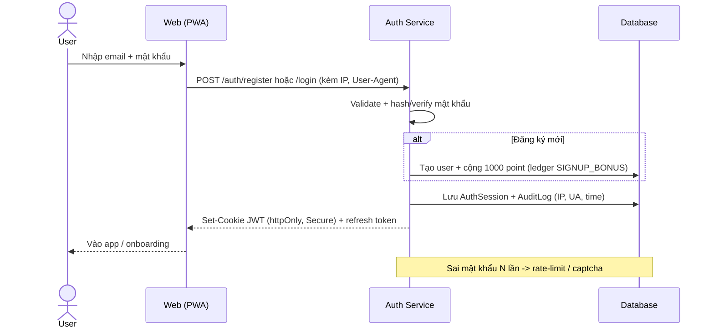

## SEQ-02 — Điểm danh hằng ngày (+200, streak)

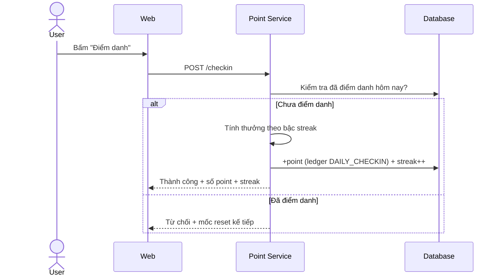

## SEQ-03 — Đặt kèo 1X2 + khoá tại kickoff

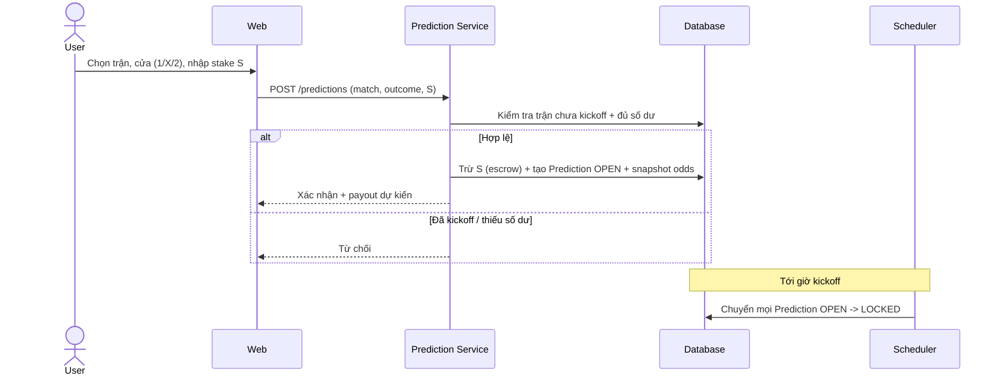

## SEQ-04 — Settle trận & chia điểm

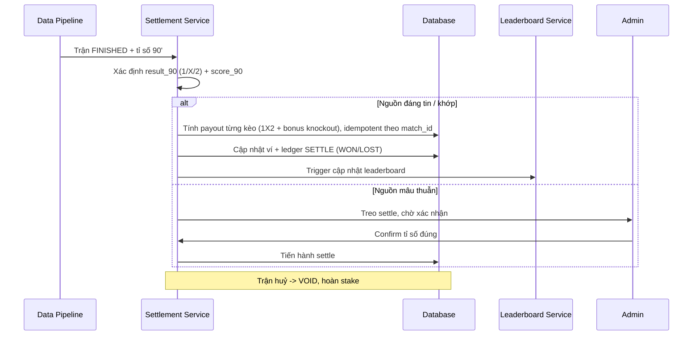

## SEQ-05 — Tạo lobby + mời + tham gia

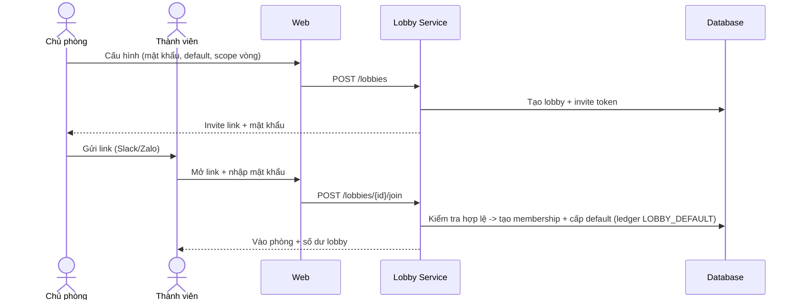

## SEQ-06 — Mượn point + duyệt

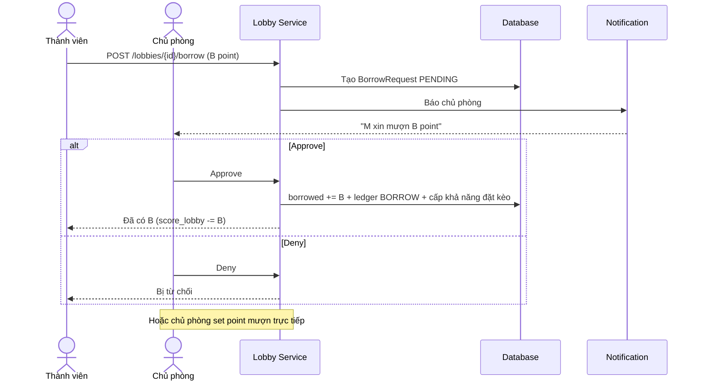

## SEQ-07 — AI ingest dữ liệu (sports API + 9router fallback)

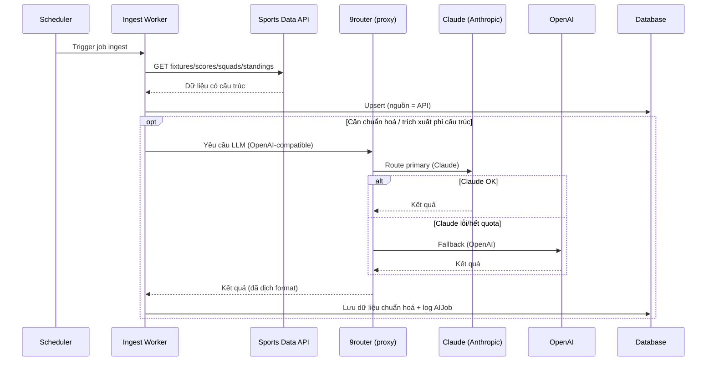

## SEQ-08 — AI sinh tin tức + review queue

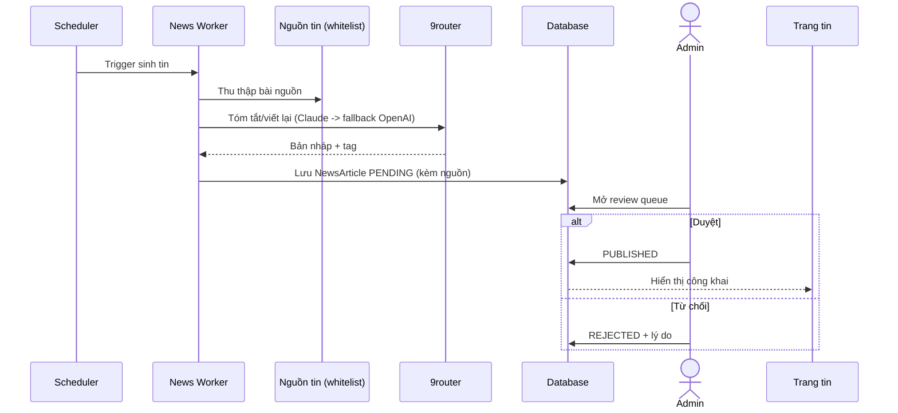

## SEQ-09 — Tổng hợp tỉ lệ kèo (odds)

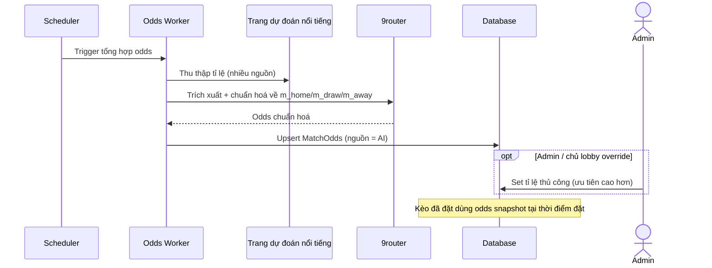

## SEQ-10 — Nộp Bracket + chấm điểm

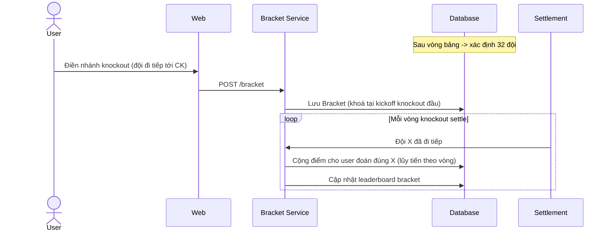

## SEQ-11 — Cập nhật Leaderboard

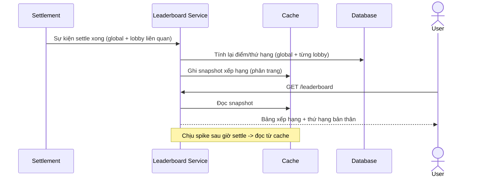

## SEQ-12 — Admin gắn cờ & xử lý lobby nghi vấn

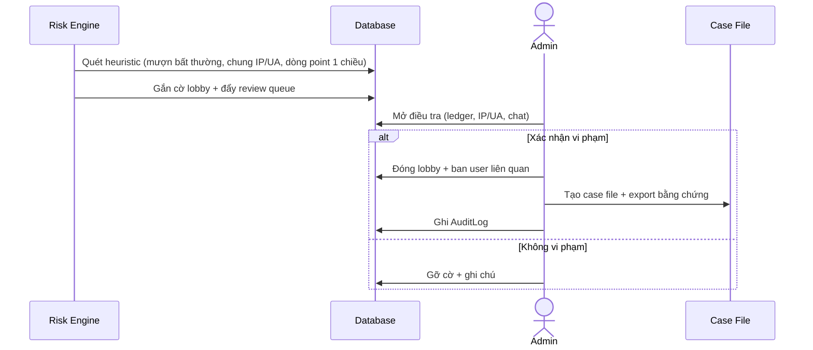
