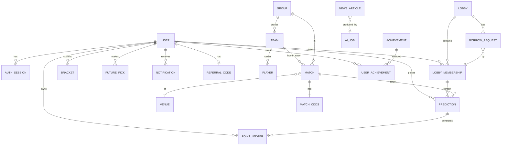

# 14 — Data Model

Mô hình dữ liệu mức khái niệm (conceptual). Chi tiết kiểu/cột là gợi ý — quyết định cuối ở giai đoạn thiết kế kỹ thuật (solution design).

---

## 1. ERD lõi (mermaid)

> Lưu ý: `PREDICTION` gắn `context` = global hoặc một `LOBBY_MEMBERSHIP` (ví global vs ví lobby độc lập — `03 §D`).

---

## 2. Từ điển thực thể

### Tài khoản & bảo mật
| Thực thể | Trường chính | Ghi chú |
|---|---|---|
| **USER** | id, email/username, password_hash, display_name, avatar, status(active/banned), tier, created_at | |
| **AUTH_SESSION** | id, user_id, refresh_token_hash, ip, user_agent, created_at, expires_at, revoked | Phục vụ bảo mật & điều tra |
| **AUDIT_LOG** | id, actor(user/admin/system), action, target, ip, ua, metadata(json), created_at | Bất biến |

### Giải đấu
| Thực thể | Trường chính | Ghi chú |
|---|---|---|
| **TEAM** | id, name, code, flag, fifa_rank, group_id | 48 đội |
| **GROUP** | id, name(A–L) | 12 bảng |
| **VENUE** | id, name, city, country | 16 sân |
| **MATCH** | id, round(group/R32/R16/QF/SF/3rd/final), group_id, home_team, away_team, venue_id, kickoff_at, status, score_home_90, score_away_90, result_90 | result_90 ∈ {1,X,2} |
| **MATCH_ODDS** | match_id, m_home, m_draw, m_away, source(api/ai/admin/lobby), updated_at | Snapshot khi đặt kèo |
| **PLAYER** | id, team_id, name, position, number | |

### Dự đoán & điểm
| Thực thể | Trường chính | Ghi chú |
|---|---|---|
| **PREDICTION** | id, user_id, context(global/lobby_membership_id), match_id, outcome(1/X/2), stake, odds_snapshot, exact_score(optional), status(OPEN/LOCKED/WON/LOST/VOID), payout | 1 kèo/trận/context |
| **POINT_LEDGER** | id, user_id, context, type(SIGNUP/DAILY/STAKE/SETTLE/BORROW/REFERRAL/PURCHASE/ADMIN_ADJ), amount(+/-), balance_after, ref_id, created_at | **Nguồn chân lý về point** |
| **BRACKET** | id, user_id, picks(json: round→team), locked_at, score | `06 DEPTH-01` |
| **FUTURE_PICK** | id, user_id, market(champion/golden_boot/...), selection, stake, odds_snapshot, status | `06 DEPTH-02` |

### Lobby
| Thực thể | Trường chính | Ghi chú |
|---|---|---|
| **LOBBY** | id, owner_id, name, password_hash, invite_token, scope(round/match), default_points, allow_borrow, manual_odds, status | |
| **LOBBY_MEMBERSHIP** | id, lobby_id, user_id, role(owner/member), default, borrowed, joined_at | `winnings` suy ra từ ledger context=lobby |
| **BORROW_REQUEST** | id, lobby_id, membership_id, amount, status(PENDING/APPROVED/DENIED), decided_by, decided_at | |

### Engagement & social
| Thực thể | Trường chính | Ghi chú |
|---|---|---|
| **STREAK** | user_id, checkin_streak, win_streak, last_checkin_date | |
| **MISSION / MISSION_PROGRESS** | mission def + tiến độ theo user/ngày | |
| **ACHIEVEMENT / USER_ACHIEVEMENT** | định nghĩa badge + sở hữu | |
| **NOTIFICATION** | id, user_id, type, channel, payload, status, sent_at | |
| **NOTIFICATION_PREF** | user_id, type, channel, enabled | |
| **REFERRAL_CODE / REFERRAL** | code theo user + bản ghi mời (A→B, status) | Chống tự-refer |
| **DUEL** | id, challenger, opponent, scope, status, winner | v2 |

### Nội dung & AI
| Thực thể | Trường chính | Ghi chú |
|---|---|---|
| **NEWS_ARTICLE** | id, title, body, tags, source_url, status(PENDING/PUBLISHED/REJECTED/UNPUBLISHED), ai_job_id, published_at | |
| **AI_JOB** | id, type(ingest/news/odds/preview), provider_used(claude/openai), status, tokens, cost, error, created_at | Theo dõi 9router |
| **AI_PREVIEW** | match_id, content, generated_at, provider | Cache AI Pundit |
| **COSMETIC_ITEM / USER_COSMETIC** | item shop + sở hữu | v2 |
| **LEADERBOARD_SNAPSHOT** | scope(global/lobby_id), rankings(json/paged), updated_at | Cache phục vụ spike |

---

## 3. Ràng buộc & toàn vẹn dữ liệu

- **Point = nguồn chân lý ở `POINT_LEDGER`** (append-only). Số dư là tổng hợp/`balance_after` của ledger → đối soát được, không sửa trực tiếp.
- **Snapshot odds** trên `PREDICTION` & `FUTURE_PICK` (không phụ thuộc odds hiện tại lúc settle).
- **Settle idempotent** theo `match_id` (không chia 2 lần).
- **Ví global ≠ ví lobby**: phân tách theo `context`; point không chuyển giữa context.
- **Soft-delete + audit** cho dữ liệu nhạy cảm; không xoá cứng ledger/audit.
