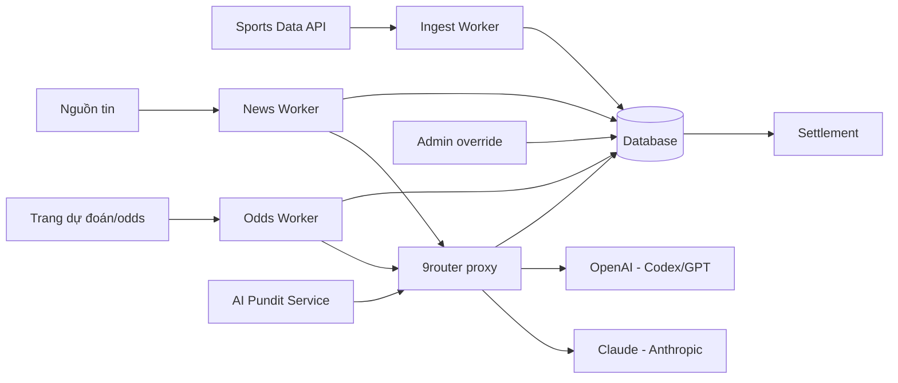

# 15 — Data Pipeline & AI Integration

Chiến lược **hybrid**: API thể thao có cấu trúc cho dữ liệu *sống & chính xác*; **AI (qua 9router)** cho sinh nội dung & trích xuất phi cấu trúc. Mục tiêu: chính xác cho việc chia điểm, linh hoạt cho nội dung.

---

## 1. Nguồn dữ liệu & thứ tự ưu tiên (precedence)

> **Chính sách nguồn (chốt OQ-02/03):** chỉ tích hợp provider cho phép **FREE**. Nếu free không đủ → **dùng AI provider crawl** (qua 9router) để bù.

| Loại dữ liệu | Nguồn chính (FREE) | Nguồn phụ / fallback | Ưu tiên cuối |
|---|---|---|---|
| Fixtures, giờ, sân, đội hình | **Free API**: worldcup2026 / OpenFootball / TheSportsDB / API-Football free | **AI crawl** khi free thiếu/thiếu field | **Admin override** |
| Tỉ số trực tiếp & kết quả (settle) | **Free API realtime** (worldcup2026 / TheSportsDB / API-Football free) | **AI crawl** để *đối chiếu/bù* — **không tự quyết settle**, phải admin confirm | **Admin override + confirm** |
| BXH vòng bảng | Tính từ kết quả (free API) | — | Admin override |
| Tỉ lệ kèo (odds) | **Free-tier odds API**: OddsPapi / Odds-API.io / The Odds API | **AI crawl** whoscored / oddsportal khi quota cạn/thiếu | **Admin / chủ lobby override** |
| Tin tức bên lề | **AI crawl + sinh** (qua 9router) | — | Admin duyệt (review queue) |
| Preview / smart pick | **AI (LLM)** grounded trên dữ liệu free API | — | — |

**Nguyên tắc vàng:** *dữ liệu ảnh hưởng chia điểm (tỉ số, kết quả) ưu tiên nguồn có cấu trúc + admin confirm; AI (kể cả khi crawl bù) **không tự quyết** tỉ số settle — phải qua admin confirm.*

### 1.1 Provider candidates FREE (đã nghiên cứu 2026-05-30)

| Nhóm | Provider | Free? | Ghi chú |
|---|---|---|---|
| Data WC2026 | **worldcup2026 API** | ✅ no key | REST realtime: teams/groups/matches/stadiums/live scores/standings |
| Data WC2026 | **OpenFootball** (`openfootball/worldcup.json`) | ✅ public-domain JSON | Fixtures/teams/groups; không realtime → dùng nền tĩnh |
| Data WC2026 | **TheSportsDB** | ✅ free tier | Fixtures/results + artwork |
| Data WC2026 | **API-Football** | ⚠️ free tier (giới hạn req) | WC2026: `league=1&season=2026`, 104 trận + fixture id/venue/status |
| Odds | **OddsPapi** | ✅ 250 req/tháng | 1X2 + nhiều market, 350+ bookmaker |
| Odds | **Odds-API.io** | ✅ 100 req/giờ | Test/dev/personal |
| Odds | **The Odds API** | ✅ free tier (credit) | h2h (1X2) |
| Odds fallback | AI-crawl whoscored / oddsportal | — | Khi free quota cạn / thiếu trận |

> Free-tier **giới hạn request** → bắt buộc **cache mạnh** + polling hợp lý; **AI-crawl** là đường lui. Chọn provider cuối cùng = OQ-23 (sau spike test coverage WC2026).

---

## 2. Kiến trúc pipeline

**Workers:**
- **Ingest Worker** — fixtures/scores/squads/standings từ API; upsert; cập nhật trạng thái trận.
- **Odds Worker** — thu thập tỉ lệ nhiều nguồn → LLM chuẩn hoá về `m_home/m_draw/m_away`.
- **News Worker** — crawl nguồn whitelist → LLM tóm tắt/viết lại → `PENDING` review.
- **AI Pundit Service** — sinh preview/smart pick on-demand + cache.

---

## 3. Tích hợp 9router (LLM gateway)

**9router** (`github.com/decolua/9router`): proxy LLM **OpenAI-compatible** (endpoint `http://localhost:20128/v1`), tự dịch format & **auto-fallback** giữa providers, quota tracking.

**Cách dùng trong sản phẩm:**
- App gọi **một** endpoint OpenAI-compatible của 9router → 9router định tuyến:
  - **Primary: Claude (Anthropic)** — chất lượng cho tóm tắt/nhận định/preview.
  - **Fallback: OpenAI (Codex/GPT)** — khi Claude lỗi/hết quota/timeout.
- Tận dụng: **prompt caching** (dữ liệu nền trận), **quota & cost tracking**, **format translation**, **request logging** (debug), **multi-account** nếu cần.
- **Structured output**: yêu cầu LLM trả JSON theo schema (vd odds, tag tin) để parse an toàn.

> Mọi model vẫn là LLM của **Anthropic hoặc OpenAI**; 9router chỉ là lớp proxy/định tuyến (xác nhận từ chủ sản phẩm).

**Theo dõi (AIJob):** mỗi lần gọi ghi `provider_used`, tokens, cost, latency, status, error → dashboard `ADMIN-07`.

---

## 4. Nhịp cập nhật (cadence)

| Giai đoạn | Hành động | Tần suất (gợi ý) |
|---|---|---|
| Trước trận | Ingest fixtures/đội hình, sinh preview, cập nhật odds | Định kỳ + khi có thay đổi đội hình |
| Đang đá (LIVE) | Poll/push tỉ số | Vài chục giây/lần (xem NFR) |
| Kết thúc | Xác nhận FINISHED + tỉ số 90' → trigger settle | Ngay khi có kết quả |
| Hằng ngày | Sinh tin tức, làm mới odds market futures | Theo lịch |

> Cân nhắc **webhook/push** từ API nếu hỗ trợ (giảm polling, real-time hơn) — `20-open-questions.md`.

---

## 5. Grounding & chống "bịa" (hallucination)

- LLM **chỉ** nhận dữ liệu thật (từ DB/API) trong prompt; cấm bịa tỉ số/sự kiện.
- Preview/nhận định **gắn disclaimer** "tham khảo" (`16`).
- Tin tức qua **review queue** (human-in-the-loop) trước publish.
- So khớp đầu ra LLM với dữ liệu cấu trúc (vd tên đội/cầu thủ phải tồn tại) trước khi lưu.

## 6. Kiểm soát chi phí & độ tin cậy

- Prompt caching + cache kết quả (preview theo trận, odds theo chu kỳ).
- Quota tracking qua 9router; cảnh báo ngưỡng; fallback tự động.
- Retry có backoff; circuit breaker khi provider lỗi liên tục.
- Batch khi có thể (nhiều trận/1 lần) để giảm overhead.

## 7. Xử lý lỗi

| Lỗi | Xử lý |
|---|---|
| Free API down / hết quota | Dùng cache gần nhất + **AI-crawl bù** (qua 9router) + cảnh báo; tỉ số settle phải **admin confirm** nếu chỉ có nguồn AI-crawl |
| LLM (Claude) lỗi/quota | 9router fallback OpenAI; nếu cả hai lỗi → degrade (ẩn preview, giữ dữ liệu cấu trúc) |
| Odds thiếu/không hợp lệ | Ẩn nút đặt kèo trận đó + cảnh báo admin nhập tay |
| Dữ liệu LLM không khớp schema/thực thể | Loại bỏ + log + retry; không lưu rác |
| Tỉ số nguồn mâu thuẫn | Treo settle, chờ admin confirm (`SEQ-04`) |
