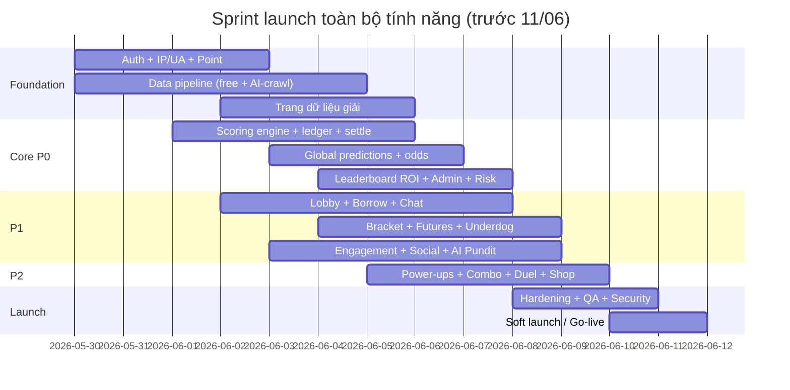

# 18 — Roadmap & Milestones

Lộ trình bám lịch **FIFA World Cup 2026**. Hôm nay: **2026-05-30**.

## Mốc giải đấu (ràng buộc thời gian)

| Mốc | Ngày |
|---|---|
| Hôm nay | 2026-05-30 |
| **Khai mạc** (Mexico vs Nam Phi) | **2026-06-11** |
| Vòng bảng | 06-11 → 06-27 |
| Vòng 32 đội (Round of 32) bắt đầu | 2026-06-29 |
| **Chung kết** (MetLife) | **2026-07-19** |

## Chiến lược release (chốt OQ-01)

> **Quyết định:** **launch TOÀN BỘ tính năng trong 1 lần, trước khai mạc 11/06.** Không chia release theo phase.
> Nhãn **P0/P1/P2** dưới đây = **thứ tự ưu tiên build** trong sprint 12 ngày (để biết build gì trước), **không** phải mốc release riêng.

> ⚠️ **Rủi ro tiến độ:** 12 ngày cho toàn bộ tính năng (greenfield) là **rất nén** → chỉ khả thi với **nhiều workstream song song / đủ nhân lực**. Giữ **cut-line: P2 có thể tách ra sau khai mạc** nếu trễ, để bảo toàn ngày launch. Theo dõi tiến độ hằng ngày.

---

## Ưu tiên build (cùng 1 lần launch)

### P0 — Lõi (không có thì không chơi được)
1. Auth (đăng ký/đăng nhập, JWT cookie, **IP/UA**), 1000 point đăng ký, điểm danh +200 (UTC+7).
2. **Pipeline ingest** (free API + AI-crawl fallback) fixtures/đội/lịch/tỉ số + trang dữ liệu giải.
3. **Global mode**: kèo 1X2 + odds, khoá kickoff, **scoring engine** + ledger, **settle**.
4. **Leaderboard global ROI-based** (cache).
5. **Admin core**: user, dữ liệu/odds override, audit log, re-settle, **risk-engine + giám sát lobby**.
6. Thông báo nhắc khoá kèo & kết quả; tin tức cơ bản + review queue.

### P1 — Xã hội & chiều sâu
- Private lobby + scope vòng + **mượn point** + leaderboard lobby + chat/reaction.
- **Bracket Predictor**, **Futures**, **Underdog bonus**.
- Streak (điểm danh + chuỗi thắng), Missions, Achievements; thông báo đầy đủ.
- **Share card**, **Referral**, **AI Pundit** (preview/smart pick), news AI đầy đủ, dashboard pipeline AI.

### P2 — Nâng cao (cut-line nếu trễ)
- Power-ups, Combo/Parlay, In-play micro-prediction.
- Duel 1v1, activity feed.
- Cosmetic shop (point sink), Predictor tiers theo mùa.

> **Lưu ý kích hoạt theo dữ liệu:** Bracket Predictor & một số market Futures **ship ở launch** nhưng chỉ **kích hoạt được khi đủ điều kiện** (Bracket mở sau khi xác định 32 đội ~27/06). Tính năng có sẵn từ đầu, dữ liệu mở khoá theo lịch giải.

---

## Sơ đồ lộ trình (mermaid) — sprint 12 ngày, workstream song song

---

## Phụ thuộc & đường găng (critical path)
- **Pipeline dữ liệu** là tiền đề cho mọi thứ (không có fixtures/tỉ số → không đặt kèo/settle). Ưu tiên #1.
- **Scoring engine + ledger** là lõi → test kỹ trước khi mở cho người dùng.
- **Risk engine/giám sát lobby** phải có **cùng** lúc mở private lobby (chống lạm dụng ngay từ đầu — `16`).
- **Bracket** kích hoạt sau vòng bảng (~06-27) dù code ship ở launch.
- **AI Pundit/news/odds** phụ thuộc 9router + nguồn free + AI-crawl ổn định.
- **Bảo mật & chống cá độ** (`16`) là hạng mục launch-blocking, không cắt.
