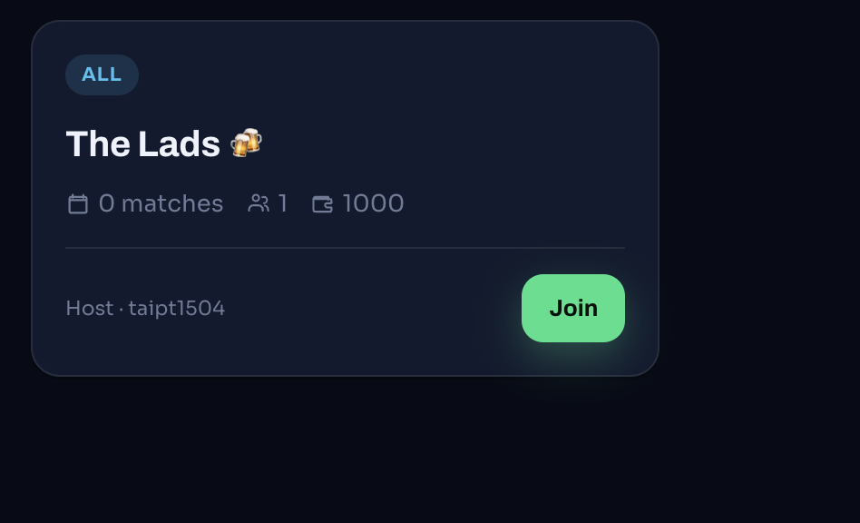
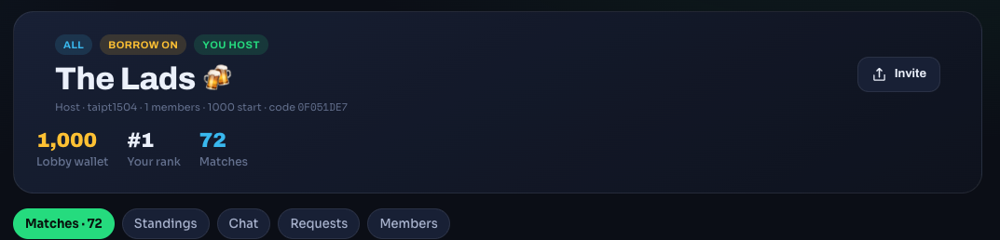
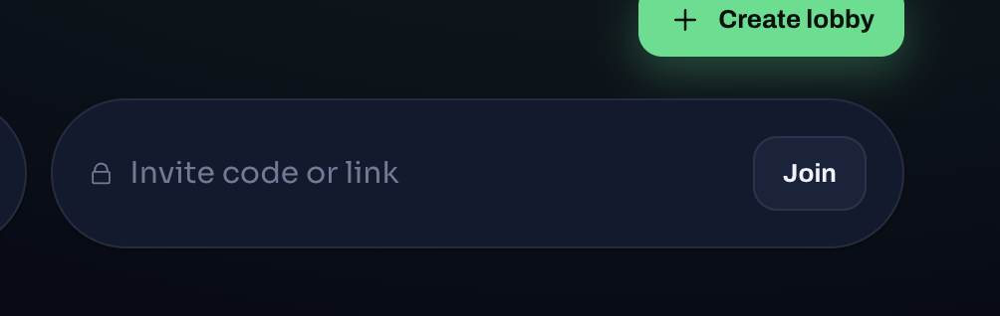

# Task: Fix các issues sau khi verify

## Issues:

- Đăng nhập, đăng ký:
  - Hiện tại UI input mật khẩu đang không có button on/off view pass
  - Đăng ký:
    - Hiện đang không có confirm password
    - Chưa support đăng nhập với google
  - Đăng nhập:
    - Chưa implement authentication với JWT dẫn với việc chỉ cần F5 sẽ bị logout ra khỏi web
- Feature Lobby:
  - Flow user join lobby hiện tại chưa được implement:
    - User action button Join đang không có popup để nhập pass của lobby 
  - Flow invite user vào lobby hiện tại cũng chưa work:
    - Chủ lobby hiện đang không lấy được real link để mời user vào lobby 
    - User nhập link tại input invite code or link cũng đang không work 
- Thông tin danh sách các đội, các cầu thủ của đội, danh sach bảng chưa lấy real data cũng như có cơ chế dùng AI crawl data để update realtime dữ liệu
- Feature Tournament:
  - Hiện tại chưa integrate full API cho các action ở phía admin và user:
    - Admin block bet nhưng user vẫn có thể bet được
    - Admin confirm kết quả trận đấu nhưng user không thấy kết quả cũng như không tính point của trận đấu đó
- Các tính năng năng ở cả phía admin và phía user đang missing, chưa integrate APIs rất nhiều, các button, các actions đang không hoạt động đúng APIs, đang dùng mock UI, data

## Yêu cầu:

- Đối với các Button, các action ở phía UI đều phải deep dive, brainstorm và integration đúng APIs đúng data đúng UI cần render
- Đảm bảo 100% data sử dụng đều là real data
- Tích hợp AI vào việc crawl data, viết news
- Đảm bảo các tính năng từ docs design được implement đầy đủ
- Audit deep dive vào từng features, từng button, action, elements, đảm bảo real working 100%
