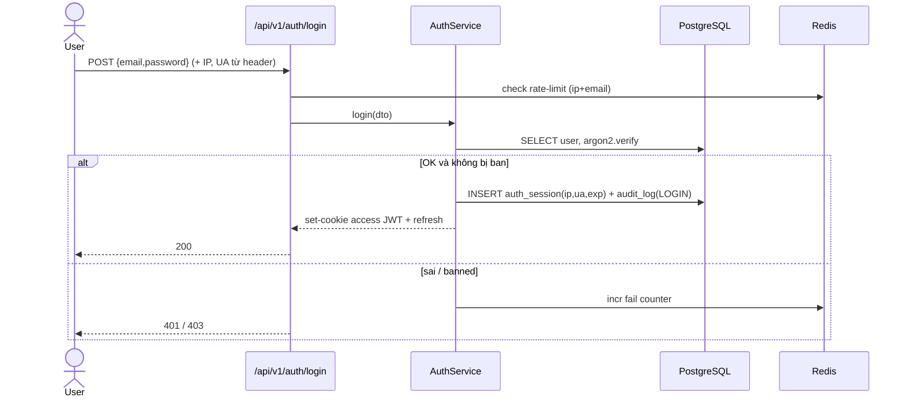

# Auth & Account (+ Wallet/Ledger) — Service Design

> **Version**: 1.0 — Draft · **Date**: 2026-05-30
> **Solution Design**: [→ overview](./2026-05-30-wc-game-solution-design.md)
> **PRD refs**: [Core §03](../prd/03-features-core.md), [Security §16](../prd/16-security-compliance.md)

> Độ chi tiết **medium**. Bảo mật là phần trọng tâm (viết kỹ).

## 1. Overview

**Purpose:** đăng ký/đăng nhập (JWT cookie), thu thập IP/UA, profile, referral code, và **cấp point** (đăng ký 1000, điểm danh 200/ngày UTC+7) ghi vào ledger.

**Boundaries:** schema `wallet`/`point_ledger` do [Prediction&Scoring SD §6](./2026-05-30-prediction-scoring-service-design.md#6-database-design) định nghĩa (shared); module này **ghi ledger** loại `SIGNUP/DAILY/REFERRAL` + **đọc** số dư/lịch sử. Tính điểm kèo/settle → Prediction module.

## 2. Tech Stack

Next.js Route Handlers + NestJS module · PostgreSQL/Prisma · Redis (rate-limit, session optional) · `argon2` (hash), `jose` (JWT). Theo [ADR-0002](./decisions/ADR-0002-typescript-nextjs.md).

## 3. Use Cases (Detailed)

### UC-01 Đăng ký

Flow: validate → `argon2` hash → insert `user` → **tx**: tạo `wallet(GLOBAL)` + ledger `SIGNUP +1000` → tạo session (JWT cookie) + `audit_log(REGISTER, ip, ua)`.
Exception: email tồn tại → 409; mật khẩu yếu → 422. Idempotent: bonus 1000 chỉ 1 lần (gắn với tạo user).

### UC-02 Đăng nhập

Flow: verify hash → phát **access JWT (cookie httpOnly+Secure+SameSite)** + **refresh token** (rotate) → ghi `auth_session(ip, ua, expires)` + audit.
Exception: sai N lần → rate-limit + captcha; user `banned` → 403.

### UC-03 Điểm danh (+200, UTC+7)

Flow: kiểm tra chưa điểm danh "hôm nay" (mốc **UTC+7**) → tx: wallet `GLOBAL` += thưởng(streak) + ledger `DAILY` → cập nhật streak. Đã điểm danh → 409 + mốc reset.

### UC khác: đổi mật khẩu, quên/reset (email), xem profile + ví/lịch sử (đọc ledger).

## 4. Sequence — Đăng nhập (JWT cookie + IP/UA)



## 5. Database (sở hữu bởi module này)

```sql
CREATE TABLE "user" (
    id            BIGSERIAL PRIMARY KEY,
    email         VARCHAR(255) UNIQUE NOT NULL,
    username      VARCHAR(50) UNIQUE,
    password_hash VARCHAR(255) NOT NULL,
    display_name  VARCHAR(100),
    avatar_url    VARCHAR(500),
    role          VARCHAR(16) NOT NULL DEFAULT 'USER',  -- USER|MOD|ADMIN|OPS|SUPER
    status        VARCHAR(16) NOT NULL DEFAULT 'ACTIVE',-- ACTIVE|BANNED|SUSPENDED
    tier          VARCHAR(16),                          -- predictor tier (v2)
    created_at    TIMESTAMPTZ NOT NULL DEFAULT now()
);
CREATE TABLE auth_session (
    id                 BIGSERIAL PRIMARY KEY,
    user_id            BIGINT NOT NULL REFERENCES "user"(id),
    refresh_token_hash VARCHAR(255) NOT NULL,
    ip                 INET,
    user_agent         TEXT,
    created_at         TIMESTAMPTZ NOT NULL DEFAULT now(),
    expires_at         TIMESTAMPTZ NOT NULL,
    revoked_at         TIMESTAMPTZ
);
CREATE TABLE audit_log (
    id         BIGSERIAL PRIMARY KEY,
    actor_type VARCHAR(10) NOT NULL,    -- USER|ADMIN|SYSTEM
    actor_id   BIGINT,
    action     VARCHAR(32) NOT NULL,    -- REGISTER|LOGIN|BAN|RESETTLE|...
    target     VARCHAR(64),
    ip         INET,
    user_agent TEXT,
    metadata   JSONB,
    created_at TIMESTAMPTZ NOT NULL DEFAULT now()
);
CREATE TABLE referral_code ( user_id BIGINT PRIMARY KEY, code VARCHAR(16) UNIQUE NOT NULL );
CREATE TABLE referral (
    id          BIGSERIAL PRIMARY KEY,
    referrer_id BIGINT NOT NULL,
    referee_id  BIGINT NOT NULL UNIQUE,
    status      VARCHAR(12) NOT NULL DEFAULT 'PENDING', -- PENDING|ACTIVATED|REJECTED
    created_at  TIMESTAMPTZ NOT NULL DEFAULT now()
);
CREATE INDEX idx_session_user ON auth_session(user_id);
CREATE INDEX idx_audit_actor ON audit_log(actor_type, actor_id, created_at DESC);
CREATE INDEX idx_audit_ip ON audit_log(ip);
```

## 6. API

`POST /auth/register` · `POST /auth/login` · `POST /auth/refresh` · `POST /auth/logout` · `POST /auth/forgot` · `POST /auth/reset` · `POST /checkin` · `GET /me` · `PATCH /me` · `GET /me/wallet?context=` (số dư + lịch sử ledger) · `GET /me/referral`.

## 7. Security (trọng tâm — theo PRD §16)

- JWT **cookie httpOnly+Secure+SameSite**; access ngắn hạn + refresh rotation, phát hiện reuse → revoke.
- `argon2id` hash; chính sách độ mạnh.
- **Rate-limit** login/register (Redis, theo ip+email) + captcha khi vượt ngưỡng.
- **CSRF**: SameSite + CSRF token cho mutation.
- Thu thập **IP/UA** mỗi session/đăng nhập → `audit_log` (phục vụ risk-engine & điều tra; retention 12 tháng rồi ẩn danh — OQ-17).
- RBAC server-side (`role`). 2FA cho admin (Should).
- Không log mật khẩu/token.

## 8. Testing & Config

- Test: hash/verify, JWT phát/refresh/revoke, rate-limit, idempotent signup-bonus, mốc điểm danh UTC+7.
- Env: `JWT_SECRET`/key, `ACCESS_TTL`, `REFRESH_TTL`, `ARGON2_*`, `RATE_LIMIT_*`, `TIMEZONE=UTC+7`.

## 9. Open Questions

| #     | Vấn đề                                      | Hướng                            |
| ----- | ------------------------------------------- | -------------------------------- |
| AA-01 | Social login (Google) cho onboarding nhanh? | Cân nhắc post-launch             |
| AA-02 | Session lưu DB hay Redis?                   | DB (audit) + Redis cache nếu cần |
