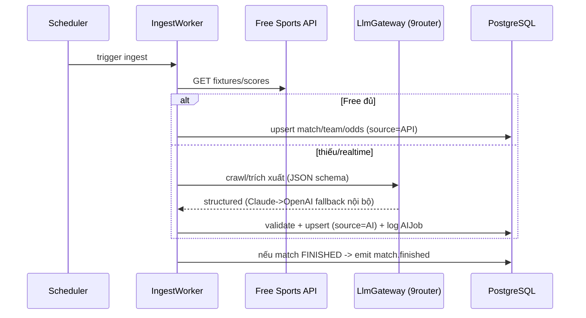

# Tournament Data + AI/Pipeline — Service Design

> **Version**: 1.0 — Draft · **Date**: 2026-05-30
> **Solution Design**: [→ overview](./2026-05-30-wc-game-solution-design.md)
> **PRD refs**: [Data §03B](../prd/03-features-core.md), [Pipeline §15](../prd/15-data-pipeline-ai.md), [News §10](../prd/10-news.md), [ADR-0005](./decisions/ADR-0005-9router-gateway.md)

> Độ chi tiết **medium**. Gồm 2 phần: (A) read model dữ liệu giải, (B) pipeline ingest + AI qua 9router.

## 1. Overview
**Purpose:** nạp & phục vụ dữ liệu giải (đội/bảng/trận/odds/cầu thủ/BXH); sinh tin tức + AI Pundit; tích hợp LLM qua 9router.
**Boundaries:** không tính điểm (Prediction module đọc `match`,`match_odds`); không quản trị UI (Admin module gọi override). Emit `match.finished` để trigger settle.

## 2. Tech Stack
NestJS Worker (BullMQ) + Next.js read API · PostgreSQL/Prisma · Redis (cache + lịch job) · HTTP client (undici) · **LlmGateway** (OpenAI-compatible client → 9router). Theo ADR-0002/0004/0005.

## 3. Nguồn & Precedence (PRD §15)
Free-first, AI-crawl fallback:
- **Data trận/tỉ số:** worldcup2026 / OpenFootball / TheSportsDB / API-Football free → fallback **AI-crawl**; tỉ số settle **không** để AI tự quyết (admin confirm nếu chỉ có AI).
- **Odds:** OddsPapi / Odds-API.io / The Odds API → fallback AI-crawl (whoscored/oddsportal).
- **Tin tức:** AI crawl + sinh (review queue).
- Ưu tiên cuối: **admin override**.

## 4. Workers & Cadence
| Worker | Job | Nhịp |
|---|---|---|
| IngestWorker | fixtures/đội/lịch/đội hình/BXH | định kỳ + khi đổi đội hình |
| LiveScoreWorker | tỉ số LIVE → cập nhật; FINISHED → emit `match.finished` | 30–60s khi có trận |
| OddsWorker | tổng hợp/chuẩn hoá `m_home/m_draw/m_away` | định kỳ trước trận |
| NewsWorker | crawl → LLM tóm tắt/viết lại → `PENDING` | hằng ngày |
| PunditWorker | sinh preview/smart pick (cache) | trước trận / on-demand |

## 5. 9router Integration (LlmGateway)
```ts
interface LlmGateway {
  complete(req: { model: string; messages: Msg[]; jsonSchema?: object }): Promise<LlmResult>;
}
// Impl: OpenAI-compatible client trỏ LLM_GATEWAY_BASE_URL + LLM_GATEWAY_API_KEY.
// 9router (team self-host sẵn) tự fallback Claude->OpenAI (combo) hoặc app set primary/fallback.
// Mọi call ghi AIJob (provider, tokens, cost, latency, status).
```
Env: `LLM_GATEWAY_BASE_URL`, `LLM_GATEWAY_API_KEY`, `LLM_MODEL_PRIMARY`, `LLM_MODEL_FALLBACK`, `LLM_TIMEOUT_MS`, `LLM_MAX_RETRIES`. Bọc sau interface → đổi gateway không sửa logic.

**Grounding:** prompt chỉ chứa dữ liệu thật (DB); structured output (JSON schema) để parse an toàn; so khớp tên đội/cầu thủ tồn tại trước khi lưu.

## 6. Sequence — Ingest + AI fallback


## 7. Database (read model — sở hữu module này)
```sql
CREATE TABLE team   ( id BIGSERIAL PK, name VARCHAR(100), code VARCHAR(8), flag_url VARCHAR(500), fifa_rank INT, group_id BIGINT );
CREATE TABLE "group"( id BIGSERIAL PK, name CHAR(1) UNIQUE );           -- A..L
CREATE TABLE venue  ( id BIGSERIAL PK, name VARCHAR(120), city VARCHAR(80), country VARCHAR(40) );
CREATE TABLE player ( id BIGSERIAL PK, team_id BIGINT, name VARCHAR(120), position VARCHAR(20), number SMALLINT );
CREATE TABLE match (
    id BIGSERIAL PRIMARY KEY,
    round VARCHAR(8) NOT NULL,            -- GROUP|R32|R16|QF|SF|3RD|FINAL
    group_id BIGINT, home_team_id BIGINT, away_team_id BIGINT, venue_id BIGINT,
    kickoff_at TIMESTAMPTZ NOT NULL,
    status VARCHAR(12) NOT NULL DEFAULT 'SCHEDULED', -- SCHEDULED|LIVE|FINISHED|POSTPONED|CANCELLED
    score_home_90 SMALLINT, score_away_90 SMALLINT,
    result_90 CHAR(1),                    -- 1|X|2 (do Prediction đọc khi settle)
    source VARCHAR(8), updated_at TIMESTAMPTZ DEFAULT now()
);
CREATE TABLE match_odds (
    match_id BIGINT PRIMARY KEY REFERENCES match(id),
    m_home NUMERIC(6,2), m_draw NUMERIC(6,2), m_away NUMERIC(6,2),
    source VARCHAR(8) NOT NULL,           -- API|AI|ADMIN|LOBBY
    updated_at TIMESTAMPTZ DEFAULT now()
);
CREATE TABLE news_article (
    id BIGSERIAL PRIMARY KEY, title VARCHAR(300), body TEXT, tags TEXT[],
    source_url VARCHAR(500), ai_job_id BIGINT,
    status VARCHAR(12) NOT NULL DEFAULT 'PENDING', -- PENDING|PUBLISHED|REJECTED|UNPUBLISHED
    published_at TIMESTAMPTZ, created_at TIMESTAMPTZ DEFAULT now()
);
CREATE TABLE ai_job (
    id BIGSERIAL PRIMARY KEY, type VARCHAR(12), provider_used VARCHAR(10),
    status VARCHAR(12), tokens INT, cost NUMERIC(10,4), latency_ms INT,
    error TEXT, created_at TIMESTAMPTZ DEFAULT now()
);
CREATE TABLE ai_preview ( match_id BIGINT PRIMARY KEY, content JSONB, provider VARCHAR(10), generated_at TIMESTAMPTZ );
CREATE INDEX idx_match_kickoff ON match(kickoff_at);
CREATE INDEX idx_match_status ON match(status);
CREATE INDEX idx_news_status ON news_article(status, published_at DESC);
```

## 8. API (read + AI)
`GET /teams` · `GET /teams/:id` · `GET /groups` · `GET /matches?team=&date=&round=` · `GET /matches/:id` · `GET /matches/:id/odds` · `GET /matches/:id/pundit` (preview/smart pick + disclaimer) · `GET /news?tag=` · `GET /news/:id` · `GET /standings`.
Admin (Admin module gọi): override match/odds, trigger re-ingest, duyệt news.

## 9. Resilience & Caching
- Free-tier **giới hạn request** → cache mạnh (Redis) + polling hợp lý + AI-crawl đường lui.
- Circuit breaker + retry/backoff cho API & LLM; LLM lỗi → degrade (ẩn preview, giữ data cấu trúc).
- Cache: `match_odds:{id}` tới kickoff; `pundit:{id}`; danh sách trận/news.
- Tỉ số lệch nguồn → không tự settle (Prediction xử lý qua `PENDING_REVIEW`).

## 10. Testing & Open Questions
- Test: parser/normalizer odds → `m_*`; validate LLM output khớp schema + thực thể; emit `match.finished` đúng khi FINISHED.
- OQ: DA-01 provider cuối (SD-02/OQ-23); DA-02 webhook vs polling tỉ số; DA-03 chống bản quyền nội dung crawl (tóm tắt + dẫn nguồn).
