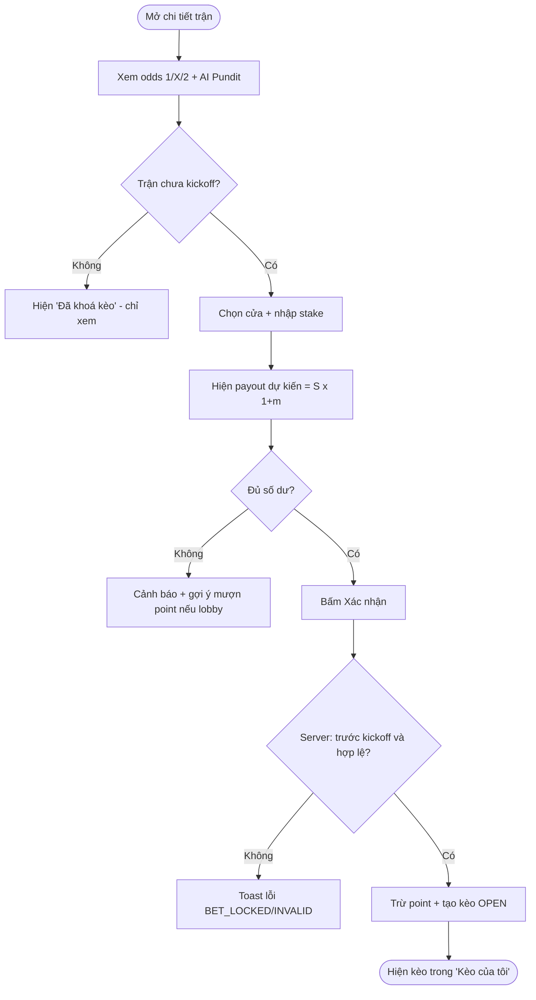
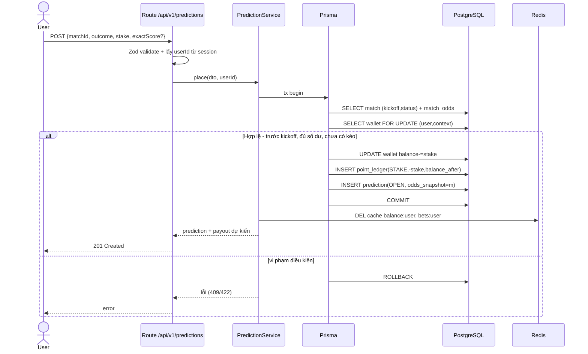
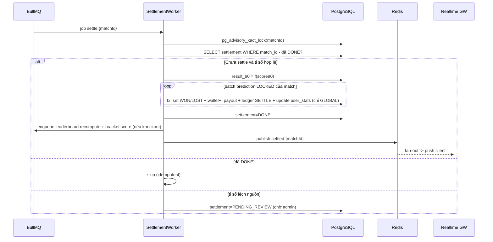
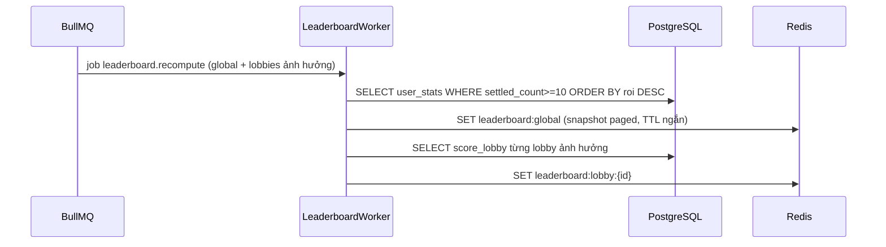
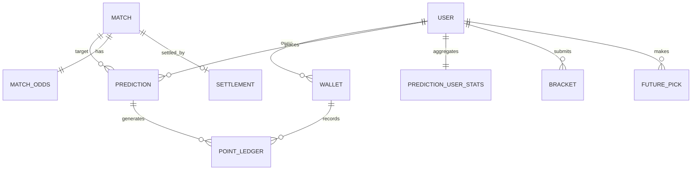

# Prediction & Scoring & Settlement — Service Design

> **Version**: 1.0 — Draft
> **Date**: 2026-05-30
> **Status**: Draft
> **Solution Design**: [→ overview](./2026-05-30-wc-game-solution-design.md)
> **PRD refs**: [Scoring §04](../prd/04-scoring-engine.md), [Data model §14](../prd/14-data-model.md), [Depth §06](../prd/06-features-prediction-depth.md)

> Module **lõi** của hệ thống. Đây là nơi tiền ảo (point) được trừ/cộng → mọi thứ phải **giao dịch, idempotent, đối soát được**.

---

## 1. Service Overview

### 1.1 Purpose
Quản lý toàn bộ vòng đời dự đoán & điểm: đặt kèo (escrow), khoá tại kickoff, **settle** (chia điểm idempotent), **sổ cái point**, **leaderboard ROI**, **Bracket**, **Futures**.

### 1.2 Responsibilities
- Đặt/sửa/huỷ kèo 1X2 (global + lobby) với **snapshot odds**.
- Tính payout: 1X2 (`S×(1+m)`) + bonus tỉ số knockout.
- **Settle** trận → cập nhật ví + ledger + aggregate ROI, **idempotent**.
- Quản lý `wallet` (số dư theo context) + `point_ledger` (append-only).
- Leaderboard **global ROI-based** + **lobby** (`score_lobby`).
- Bracket Predictor + Futures.
- Void/hoàn điểm; admin re-settle.

### 1.3 Boundaries (KHÔNG làm)
- Không crawl/ingest dữ liệu trận/tỉ số/odds → **Tournament Data + AI/Pipeline** cung cấp (đọc `match`, `match_odds`).
- Không quản lý lobby/membership → **Lobby module** (service này chỉ đọc `lobby_membership` để biết context + default/borrowed).
- Không auth → **Auth module** (nhận `userId` từ session).
- Không gửi thông báo → emit event, **Engagement** lo.

---

## 2. Tech Stack

| Layer | Technology | Rationale |
|---|---|---|
| Runtime | Node.js 22 (TypeScript) | Theo ADR-0002 |
| API | Next.js Route Handlers (`/api/v1`) | BFF trong monolith |
| Worker | NestJS + **BullMQ** | Settle/recompute async (ADR-0004) |
| DB | PostgreSQL 16 + **Prisma** | ACID, ledger (ADR-0003) |
| Cache/Queue | Redis 7 | Leaderboard snapshot + queue + pub/sub |
| Realtime | Socket.io (qua Realtime GW) | Push kết quả/leaderboard |

**Key libs:** Prisma (data + migration), BullMQ (jobs), Zod (validate input), Decimal.js (tính tiền/ROI tránh float sai).

---

## 3. Use Cases (Detailed)

### UC-04: Đặt kèo 1X2 {#uc-04}
**Actor:** User · **Pre:** đăng nhập; trận `SCHEDULED`, `now < kickoff`; có odds; đủ số dư context.

**Main flow:**
| Step | Actor | Action | System |
|---|---|---|---|
| 1 | User | Chọn trận, cửa `1/X/2`, nhập `S` (knockout: tuỳ chọn tỉ số) | Hiển thị payout dự kiến (preview) |
| 2 | User | Xác nhận | Mở **DB tx** |
| 3 | System | — | Lock `wallet` row (FOR UPDATE); kiểm tra `now<kickoff` + `S≤balance` + chưa có kèo cho (match,context) |
| 4 | System | — | Trừ `S` (wallet.balance−=S); insert `point_ledger(STAKE,−S,balance_after)`; insert `prediction(OPEN, odds_snapshot)` |
| 5 | System | — | COMMIT; invalidate cache; trả 201 |

**Alternative:** AF-01 đã có kèo (match,context) → coi như **sửa** (UC-05) thay vì tạo mới.
**Exception:** EF-01 `now≥kickoff` → 409 `BET_LOCKED`; EF-02 `S>balance` → 422 `INSUFFICIENT_BALANCE`; EF-03 chưa có odds → 409 `ODDS_UNAVAILABLE`.
**Post:** prediction `OPEN`; ledger `STAKE`; balance giảm.
**Business rules:** BR-01 `S` nguyên ≥ `min_stake`, ≤ balance. BR-02 odds_snapshot = `match_odds` tại thời điểm đặt. BR-03 1 kèo 1X2/trận/context.

### UC-05: Sửa/huỷ kèo (trước kickoff) {#uc-05}
- Sửa cửa/stake: hoàn escrow cũ + áp escrow mới trong 1 tx; cập nhật `odds_snapshot` theo odds hiện tại (đặt lại = giá mới). Huỷ: hoàn `S`, prediction `CANCELLED`.
- EF: `now≥kickoff` → 409 `BET_LOCKED`.

### UC-06: Khoá kèo {#uc-06}
- Scheduler job (mỗi phút) set `OPEN→LOCKED` cho prediction của trận đã tới `kickoff` (phục vụ UI). **Enforcement thực** = check `now<kickoff` server-side ở UC-04/05 (không tin status).

### UC-07: Settle trận & chia điểm {#uc-07}
**Actor:** Worker (+ Admin confirm khi lệch nguồn) · **Pre:** trận `FINISHED`, có `score_home_90/score_away_90` hợp lệ.

**Main flow:**
| Step | Action |
|---|---|
| 1 | Nhận event `match.finished` → enqueue job `settle:{matchId}` |
| 2 | Worker acquire **advisory lock** `matchId`; kiểm tra `settlement(matchId)` chưa `DONE` (idempotent guard) |
| 3 | Tính `result_90 ∈ {1,X,2}` từ score 90' |
| 4 | Lặp batch prediction `LOCKED` của trận (cả global + lobby): tính payout (§ scoring); set `WON/LOST`; tx: `wallet+=payout` + `ledger(SETTLE,+payout)`. **Chỉ cập nhật `prediction_user_stats` cho kèo `context=GLOBAL`** (kèo lobby KHÔNG tính vào ROI global — lobby xếp hạng bằng `score_lobby`) |
| 5 | Nếu knockout: enqueue `bracket.score` + settle market futures liên quan |
| 6 | Đánh dấu `settlement(matchId)=DONE`; enqueue `leaderboard.recompute`; publish `settled` (pub/sub) |

**Exception:** EF-01 nguồn tỉ số mâu thuẫn → `settlement=PENDING_REVIEW`, chờ admin confirm (UC-16). EF-02 trận `CANCELLED` → **VOID**: hoàn `S` mọi kèo (`ledger VOID`).
**Post:** kèo `SETTLED`; ví/ledger cập nhật; idempotent (chạy lại không chia 2 lần).

### UC-11 Bracket / UC-12 Futures
- **Bracket:** lưu `picks` (round→teamId); khoá tại kickoff knockout đầu; mỗi knockout settle → cộng điểm cho pick đúng **đội đi tiếp** (lũy tiến). 
- **Futures:** đặt point vào market (champion/golden_boot…), settle 1 lần khi có kết quả; payout như 1X2.

---

## 4. User Journey (Detailed) — Đặt kèo {#journey-place-bet}



**Error states:** 401→login; 409 BET_LOCKED→refresh trạng thái; 422 INSUFFICIENT_BALANCE→inline; 409 ODDS_UNAVAILABLE→ẩn nút.

---

## 5. Sequence Diagrams (Detailed)

### 5.1 Đặt kèo (transaction)


### 5.2 Settle (worker, idempotent)


### 5.3 Recompute leaderboard ROI


---

## 6. Database Design

### 6.1 ERD


### 6.2 DDL chính

```sql
-- Ví theo context (GLOBAL hoặc 1 lobby). Balance là số dư hiện hành (concurrency control).
CREATE TABLE wallet (
    id            BIGSERIAL PRIMARY KEY,
    user_id       BIGINT NOT NULL,
    context_type  VARCHAR(10) NOT NULL,            -- 'GLOBAL' | 'LOBBY'
    context_id    BIGINT,                          -- null nếu GLOBAL
    balance       BIGINT NOT NULL DEFAULT 0,       -- point (>=0 với GLOBAL; lobby có thể âm do borrow)
    created_at    TIMESTAMPTZ NOT NULL DEFAULT now(),
    updated_at    TIMESTAMPTZ NOT NULL DEFAULT now(),
    UNIQUE (user_id, context_type, context_id)
);

-- Sổ cái append-only: nguồn chân lý về point.
CREATE TABLE point_ledger (
    id            BIGSERIAL PRIMARY KEY,
    user_id       BIGINT NOT NULL,
    context_type  VARCHAR(10) NOT NULL,
    context_id    BIGINT,
    type          VARCHAR(16) NOT NULL,            -- SIGNUP|DAILY|STAKE|SETTLE|VOID|BORROW|REFERRAL|PURCHASE|ADMIN_ADJ
    amount        BIGINT NOT NULL,                 -- +/- 
    balance_after BIGINT NOT NULL,
    ref_type      VARCHAR(16),                     -- PREDICTION|MATCH|BRACKET|FUTURE|...
    ref_id        BIGINT,
    created_at    TIMESTAMPTZ NOT NULL DEFAULT now()
);

CREATE TABLE prediction (
    id             BIGSERIAL PRIMARY KEY,
    user_id        BIGINT NOT NULL,
    context_type   VARCHAR(10) NOT NULL,
    context_id     BIGINT,
    match_id       BIGINT NOT NULL,
    market         VARCHAR(8) NOT NULL DEFAULT '1X2',
    outcome        CHAR(1) NOT NULL,               -- '1'|'X'|'2'
    stake          BIGINT NOT NULL CHECK (stake > 0),
    odds_snapshot  NUMERIC(6,2) NOT NULL,          -- m tại thời điểm đặt
    exact_home     SMALLINT,                       -- bonus knockout (tuỳ chọn)
    exact_away     SMALLINT,
    status         VARCHAR(10) NOT NULL DEFAULT 'OPEN', -- OPEN|LOCKED|WON|LOST|VOID|CANCELLED
    payout         BIGINT NOT NULL DEFAULT 0,
    settled_at     TIMESTAMPTZ,
    created_at     TIMESTAMPTZ NOT NULL DEFAULT now(),
    -- 1 kèo 1X2 / trận / context:
    UNIQUE (user_id, context_type, context_id, match_id, market)
);

-- Idempotency guard cho settle.
CREATE TABLE settlement (
    match_id     BIGINT PRIMARY KEY,
    status       VARCHAR(16) NOT NULL,             -- DONE|PENDING_REVIEW|VOID
    result_90    CHAR(1),
    settled_at   TIMESTAMPTZ,
    settled_by   VARCHAR(16) NOT NULL DEFAULT 'SYSTEM'
);

-- Aggregate cho leaderboard ROI — CHỈ tổng hợp kèo context=GLOBAL.
-- (Kèo lobby KHÔNG ghi vào đây; lobby xếp hạng bằng score_lobby.) Do đó key chỉ cần user_id.
CREATE TABLE prediction_user_stats (
    user_id        BIGINT PRIMARY KEY,
    total_staked   BIGINT NOT NULL DEFAULT 0,
    total_returned BIGINT NOT NULL DEFAULT 0,      -- tổng payout đã nhận
    settled_count  INT NOT NULL DEFAULT 0,
    win_count      INT NOT NULL DEFAULT 0
    -- roi = (total_returned - total_staked) / NULLIF(total_staked,0)  -- tính khi đọc
);

CREATE TABLE bracket (
    id          BIGSERIAL PRIMARY KEY,
    user_id     BIGINT NOT NULL UNIQUE,
    picks       JSONB NOT NULL,                    -- {"R16":[teamIds],"QF":[...],...,"CHAMPION":teamId}
    locked_at   TIMESTAMPTZ,
    score       INT NOT NULL DEFAULT 0,
    updated_at  TIMESTAMPTZ NOT NULL DEFAULT now()
);

CREATE TABLE future_pick (
    id            BIGSERIAL PRIMARY KEY,
    user_id       BIGINT NOT NULL,
    market        VARCHAR(20) NOT NULL,            -- CHAMPION|GOLDEN_BOOT|...
    selection_id  BIGINT NOT NULL,                 -- teamId/playerId
    stake         BIGINT NOT NULL CHECK (stake>0),
    odds_snapshot NUMERIC(6,2) NOT NULL,
    status        VARCHAR(10) NOT NULL DEFAULT 'OPEN',
    payout        BIGINT NOT NULL DEFAULT 0,
    created_at    TIMESTAMPTZ NOT NULL DEFAULT now()
);
```

### 6.3 Indexes
```sql
CREATE INDEX idx_pred_match_status ON prediction(match_id, status);
CREATE INDEX idx_pred_user_ctx ON prediction(user_id, context_type, context_id, created_at DESC);
CREATE INDEX idx_ledger_user_ctx ON point_ledger(user_id, context_type, context_id, created_at DESC);
CREATE INDEX idx_ledger_ref ON point_ledger(ref_type, ref_id);
CREATE INDEX idx_stats_roi ON prediction_user_stats(((total_returned-total_staked)::numeric / NULLIF(total_staked,0)) DESC) WHERE settled_count >= 10;
```

### 6.4 Data considerations
- `point_ledger`, `settlement` **append/guard** — không sửa; `wallet.balance` cập nhật trong cùng tx với ledger (balance_after khớp).
- Số tiền dùng **BIGINT** (point nguyên); ROI tính bằng Decimal khi đọc.
- Partition `point_ledger` theo tháng nếu lớn (sau).
- Migration: Prisma migrate; thứ tự `wallet → ledger → prediction → settlement → stats → bracket → future`.

---

## 7. API Design

**Base:** `/api/v1` · **Auth:** JWT cookie (httpOnly) · **Error format:** `{ error: { code, message, details[] } }`.

### POST /api/v1/predictions — Đặt kèo
**Body:** `{ matchId, context: {type:'GLOBAL'|'LOBBY', id?}, outcome:'1'|'X'|'2', stake, exactScore?: {home,away} }`
**Validation:** stake nguyên ≥ min_stake; outcome hợp lệ; exactScore chỉ cho knockout.
**201:** `{ data: { id, status:'OPEN', oddsSnapshot, potentialPayout } }`
**Errors:** 401 UNAUTHORIZED · 409 BET_LOCKED · 409 ODDS_UNAVAILABLE · 409 DUPLICATE_BET (dùng PATCH) · 422 INSUFFICIENT_BALANCE · 422 VALIDATION_ERROR

### PATCH /api/v1/predictions/:id — Sửa (trước kickoff)
### DELETE /api/v1/predictions/:id — Huỷ (hoàn point)
### GET /api/v1/predictions?context=&status=&page= — Lịch sử kèo + ROI cá nhân
### GET /api/v1/matches/:id/payout-preview?outcome=&stake=&exact= — Preview (không ghi)
### POST /api/v1/brackets — Nộp/cập nhật bracket (trước khoá) · GET /api/v1/brackets/me
### POST /api/v1/futures — Đặt futures · GET /api/v1/futures/me
### GET /api/v1/leaderboard?scope=global|lobby:{id}&page= — đọc từ Redis snapshot
### POST /api/v1/admin/matches/:id/resettle — (ADMIN) override + re-settle idempotent

**Conventions:** camelCase JSON, page-based pagination, ISO-8601, idempotency cho POST predictions qua unique constraint (match,context).

---

## 8. Scoring Logic (đặc tả chính xác)

```ts
// 1X2 payout (vòng bảng + knockout 90')
function payout1x2(stake: bigint, m: Decimal, won: boolean): bigint {
  return won ? BigInt(new Decimal(stake.toString()).mul(m.add(1)).toFixed(0)) : 0n;
}
// Bonus tỉ số (chỉ knockout): cộng thêm nếu đúng 1X2 VÀ đúng tỉ số 90'
function knockoutBonus(stake: bigint, won1x2: boolean, exactCorrect: boolean, bonusRate: Decimal): bigint {
  return (won1x2 && exactCorrect) ? BigInt(new Decimal(stake.toString()).mul(bonusRate).toFixed(0)) : 0n;
}
// Knockout 1X2 settle theo result 90' (KHÔNG tính ET/pen). VOID -> hoàn stake.
// ROI (leaderboard global): (total_returned - total_staked) / total_staked, min settled_count>=10.
```
Tham số `min_stake`, `bonus_rate(=1.0)`, `leaderboard_min_settled(=10)` lấy từ config (PRD §04.10).

---

## 9. Events / Messages (BullMQ + pub/sub)

| Event/Job | Producer | Consumer | Ghi chú |
|---|---|---|---|
| `match.finished` | Pipeline | enqueue `settle:{id}` | Trigger settle |
| `settle:{matchId}` | Worker self | SettlementWorker | Idempotent, advisory lock |
| `leaderboard.recompute` | SettlementWorker | LeaderboardWorker | Sau settle |
| `bracket.score` | SettlementWorker | BracketWorker | Chỉ knockout |
| pub/sub `settled:{matchId}` | SettlementWorker | Realtime GW | Push kết quả/leaderboard |

Idempotency: settle dùng `settlement` table + `pg_advisory_xact_lock`. Job retry an toàn.

---

## 10. Security (service-level)
- **Authz:** mọi mutation kiểm `userId` từ session; kèo/ví chỉ chủ sở hữu thao tác (chống IDOR).
- **Khoá kèo server-side** theo `match.kickoff_at` (không tin client/status).
- **Stake validation server-side** (không tin payout/preview client gửi).
- Re-settle chỉ **ADMIN** (RBAC) + audit + thông báo user ảnh hưởng.
- Snapshot odds chống thao túng tỉ lệ sau khi đặt.

## 11. Error Handling & Resilience
- Tx ngắn, lock `wallet` theo thứ tự cố định (tránh deadlock).
- Settle batch + retry/backoff (BullMQ); advisory lock tránh race.
- Lệch nguồn tỉ số → `PENDING_REVIEW` thay vì đoán.
- Degrade: leaderboard lỗi cache → fallback query (giới hạn) + cảnh báo.

## 12. Performance & Caching
| Data | Cache | TTL | Invalidation |
|---|---|---|---|
| leaderboard:global / :lobby:{id} | Redis | 15–30s hoặc theo event | Sau recompute |
| balance:{user}:{context} | Redis | ngắn | Khi đặt kèo/settle |
| match_odds:{id} | Redis | tới kickoff | Khi odds đổi |

Leaderboard đọc từ snapshot (không tính realtime mỗi request) → chịu spike.

## 13. Testing Strategy
| Type | Scope | Trọng tâm |
|---|---|---|
| Unit | scoring | `payout1x2` (khớp ví dụ Pháp-Nhật 180/250), bonus knockout, void, ROI |
| Unit | borrow/score_lobby | công thức `winnings+default−borrowed` |
| Integration | place+settle | Testcontainers Postgres: escrow, **idempotent settle (chạy 2 lần)**, concurrency 2 kèo cùng lúc |
| Concurrency | wallet | đặt kèo song song không âm sai số dư (FOR UPDATE) |
| API | endpoints | validation + error codes |

## 14. Config & Monitoring
- **Env:** `MIN_STAKE`, `KNOCKOUT_BONUS_RATE`, `LEADERBOARD_MIN_SETTLED`, `TIMEZONE=UTC+7`, DB/Redis URL.
- **Metrics:** thời gian settle/trận, queue depth `settle`, số kèo/giây lúc kickoff, lỗi tx, độ trễ leaderboard.
- **Alerts:** settle treo > X phút, `PENDING_REVIEW` tăng, queue depth cao.

## 15. Open Questions / TODOs
| # | Vấn đề | Hướng |
|---|---|---|
| PS-01 | Bracket cộng điểm vào tổng global (trần?) — PRD OQ-10 | Bảng riêng + trần, chốt số |
| PS-02 | Combo/parlay (P2) đụng `wallet`/settle thế nào | Thiết kế khi tới P2 |
| PS-03 | Read replica cho leaderboard query nặng | Thêm khi tải tăng (SD-05) |
