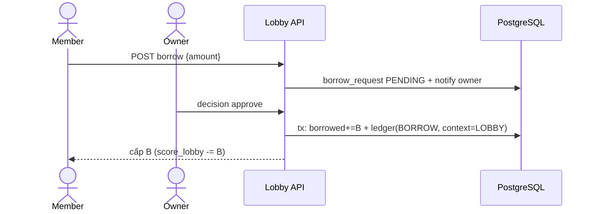
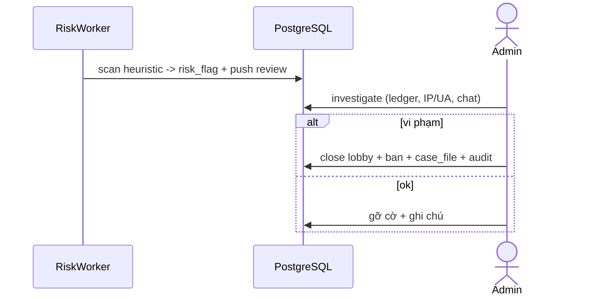

# Supporting Modules — Service Design (Light)

> **Version**: 1.0 — Draft · **Date**: 2026-05-30
> **Solution Design**: [→ overview](./2026-05-30-wc-game-solution-design.md)
> Gồm 5 module độ chi tiết **light**: **Lobby · Engagement · Social · Admin & Risk · News**. Liên kết: ví/ledger ([Prediction SD](./2026-05-30-prediction-scoring-service-design.md)), audit/IP-UA ([Auth SD](./2026-05-30-auth-account-service-design.md)), tin tức pipeline ([Data/AI SD](./2026-05-30-data-ai-pipeline-service-design.md)).

---

## A. Lobby

**Purpose:** phòng kín (mật khẩu/invite), scope vòng, mượn point, chat. Ví lobby = `wallet(context=LOBBY,id)` (Prediction sở hữu schema). `score_lobby = winnings + default − borrowed`.

**DDL:**
```sql
CREATE TABLE lobby (
    id BIGSERIAL PRIMARY KEY, owner_id BIGINT NOT NULL,
    name VARCHAR(120), password_hash VARCHAR(255), invite_token VARCHAR(40) UNIQUE,
    scope VARCHAR(16) NOT NULL,          -- ALL|GROUP|R32|R16|QF|SF|FINAL|MATCH
    scope_ref_id BIGINT,                 -- matchId nếu scope=MATCH
    default_points BIGINT NOT NULL, allow_borrow BOOLEAN DEFAULT true,
    manual_odds BOOLEAN DEFAULT false, status VARCHAR(10) DEFAULT 'OPEN',
    created_at TIMESTAMPTZ DEFAULT now()
);
CREATE TABLE lobby_membership (
    id BIGSERIAL PRIMARY KEY, lobby_id BIGINT, user_id BIGINT,
    role VARCHAR(8) DEFAULT 'MEMBER', default_points BIGINT, borrowed BIGINT DEFAULT 0,
    joined_at TIMESTAMPTZ DEFAULT now(), UNIQUE(lobby_id,user_id)
);
CREATE TABLE borrow_request (
    id BIGSERIAL PRIMARY KEY, lobby_id BIGINT, membership_id BIGINT, amount BIGINT,
    status VARCHAR(10) DEFAULT 'PENDING', decided_by BIGINT, decided_at TIMESTAMPTZ,
    created_at TIMESTAMPTZ DEFAULT now()
);
CREATE TABLE lobby_message (
    id BIGSERIAL PRIMARY KEY, lobby_id BIGINT, user_id BIGINT,
    body VARCHAR(500), kind VARCHAR(8) DEFAULT 'TEXT', -- TEXT|SYSTEM|REACTION
    created_at TIMESTAMPTZ DEFAULT now()
);
```
**API:** `POST /lobbies` · `POST /lobbies/:id/join` · `POST /lobbies/:id/borrow` · `POST /lobbies/:id/borrow/:rid/decision` · `GET /lobbies/:id/members` · `GET /lobbies/:id/leaderboard` (→ Prediction scope=lobby) · WS chat `lobby:{id}`.
**Rules:** mượn point → `borrowed+=B` + `ledger(BORROW,context=LOBBY)` + cấp khả năng đặt (giảm `score_lobby`). Chat qua Realtime GW (Socket.io room `lobby:{id}`). Mọi point lobby trong tầm giám sát Risk (mục D).

**Borrow flow:**


---

## B. Engagement

**Purpose:** streak, missions, achievements, notifications (web-push + email).
**DDL:** `streak(user_id PK, checkin_streak, win_streak, last_checkin_date)`, `mission(id,code,rule,reward)`, `mission_progress(user_id,mission_id,date,progress,claimed)`, `achievement(id,code,condition)`, `user_achievement(user_id,achievement_id,earned_at)`, `notification(id,user_id,type,channel,payload,status,sent_at)`, `notification_pref(user_id,type,channel,enabled)`.
**API:** `GET /missions/today` · `POST /missions/:id/claim` · `GET /achievements/me` · `GET/PUT /notifications/prefs` · `GET /notifications` · `POST /notifications/:id/read`.
**Rules:** streak bump khi Auth `checkin` (đọc/ghi `streak`, mốc **UTC+7**); win_streak cập nhật khi Prediction settle (lắng event). Notification: worker gửi (web-push VAPID + email), tôn trọng pref, gộp digest, chịu spike trước kickoff (queue). Reward point ghi `ledger`.

---

## C. Social

**Purpose:** share card, referral reward, duel (v2), feed (v2).
**DDL:** `duel(id,challenger_id,opponent_id,scope,status,winner_id)`, (referral/referral_code ở Auth). Share card sinh ảnh → Object Storage; OG meta.
**API:** `POST /share/card` (render ảnh → URL) · `GET /referral/me` · `POST /duels` · `POST /duels/:id/accept`.
**Rules:** **Referral reward**: lắng event "user đặt kèo đầu" → nếu referee có referral PENDING & **IP/UA không trùng referrer** → cả hai +300 (`ledger REFERRAL`), referral `ACTIVATED`; ngược lại gắn cờ Risk. Share card: render server-side (satori/`@vercel/og` hoặc canvas — SD-04) gắn referral link + OG.

---

## D. Admin & Risk

**Purpose:** quản trị user/lobby/dữ liệu/tin; **risk-engine** chống lạm dụng cá độ; audit; review queue.
**DDL:** `risk_flag(id,target_type,target_id,rule,severity,status,created_at)`, `moderation_action(id,admin_id,target_type,target_id,action,reason,created_at)`, `case_file(id,subject,evidence_ref,status,created_at)`. (audit_log ở Auth.)
**Risk-engine (worker):** quét heuristic (PRD §16): mượn point bất thường, nhiều account chung IP/UA/lobby, dòng point một chiều, lobby 2 người pattern thua/thắng, referral vòng tròn → tạo `risk_flag` + đẩy review.
**API (RBAC):** `GET /admin/users` · `POST /admin/users/:id/ban` · `GET /admin/lobbies?flagged=` · `GET /admin/lobbies/:id/investigate` (ledger+IP/UA+chat) · `POST /admin/lobbies/:id/close` · `POST /admin/cases` (+export) · `POST /admin/matches/:id/override` (→ Data) · `POST /admin/matches/:id/resettle` (→ Prediction) · `GET /admin/news?status=PENDING` · `POST /admin/news/:id/decision` · `GET /admin/ai-jobs` (quota/fallback).
**Rules:** mọi action → `audit_log` + `moderation_action`. Không giới hạn cứng đa tài khoản (OQ-19) nhưng **vẫn flag + review**. Re-settle idempotent + thông báo user ảnh hưởng.



---

## E. News (review + serve)

Pipeline sinh bài ở [Data/AI SD](./2026-05-30-data-ai-pipeline-service-design.md) (`news_article` PENDING). Module này (gộp Admin):
- **Review queue** (Admin D): duyệt `PENDING→PUBLISHED` / `REJECTED` + lý do.
- **Serve** (Data API): `GET /news`, `GET /news/:id` (dẫn nguồn, nhãn "hỗ trợ bởi AI", OG).
- Auto-publish (v1, Could): thể loại an toàn từ nguồn whitelist đạt ngưỡng → tự publish + log + cho gỡ.

---

## Open Questions
| # | Vấn đề | Hướng |
|---|---|---|
| SM-01 | Chat lobby lưu lâu dài hay TTL? | TTL/giới hạn N tin gần nhất + lưu để điều tra |
| SM-02 | Share card: `@vercel/og` (satori) vs canvas | Chốt SD-04 |
| SM-03 | Ngưỡng heuristic risk cụ thể | Tinh chỉnh sau soft-launch (tránh false-positive) |
