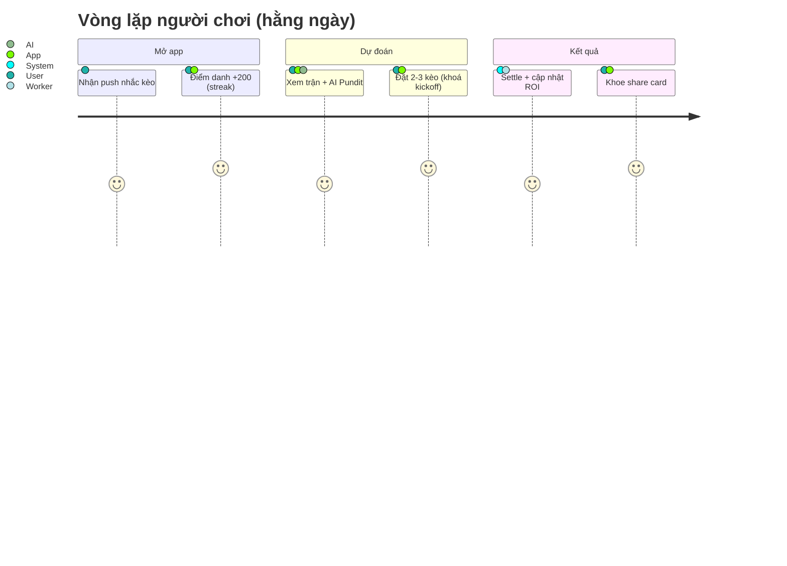
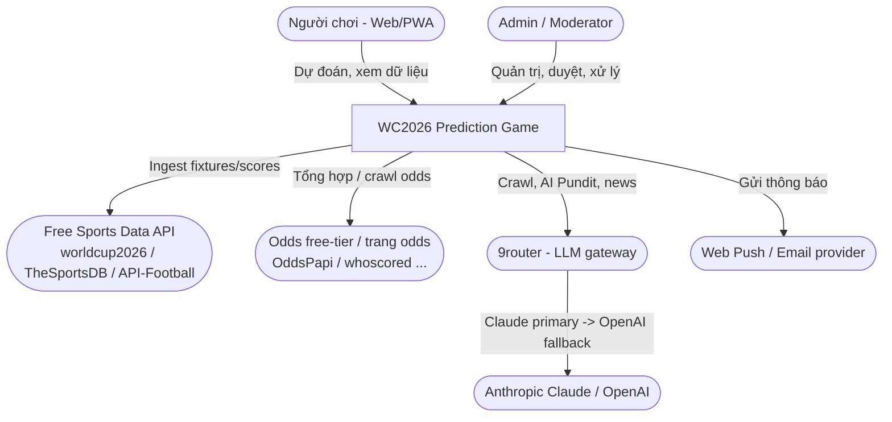
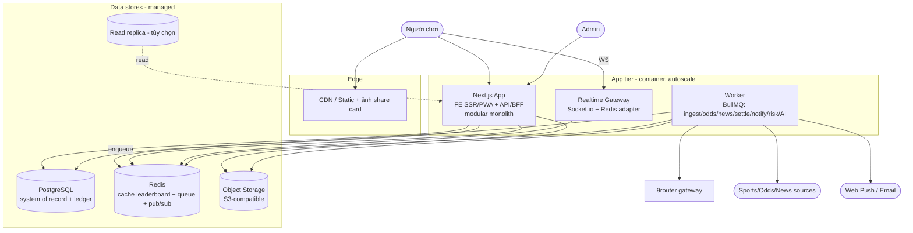
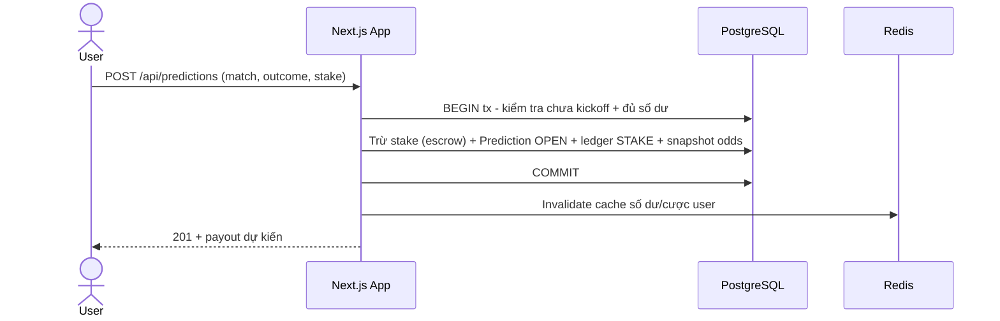
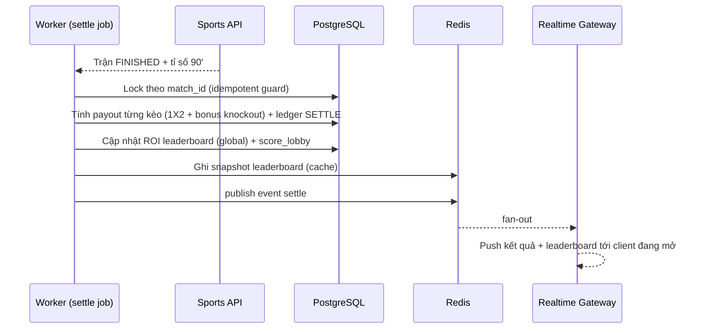
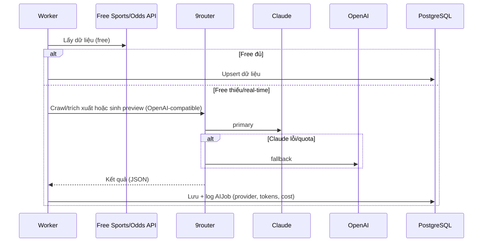

# WC2026 Prediction Game — Solution Design

> **Version**: 1.0 — Draft
> **Date**: 2026-05-30
> **Status**: Draft (chờ checkpoint)
> **Nguồn yêu cầu**: [PRD](../prd/README.md)
> **Related Service Designs**: sẽ bổ sung sau checkpoint (xem §11 Document Map)
> **ADRs**: [decisions/](./decisions/)

> ⚠️ Tài liệu **tổng quan** (overview). Chi tiết per-service (DB/DDL/API/flow nội bộ) nằm ở các **Service Design** viết sau khi chốt bản này.

---

## 1. Executive Summary

Game dự đoán FIFA World Cup 2026 (web-first/PWA) cho phép người chơi dùng **point ảo** đặt kèo 1X2 theo tỉ lệ, chơi **global** + **private lobby**, với các tính năng giữ chân/xã hội/AI. Hệ thống xây theo **modular monolith (Next.js full-stack) + background worker**, dùng **PostgreSQL** (system of record, ledger ACID), **Redis** (cache leaderboard + queue settle/job), **WebSocket** (chat lobby + live score), và **9router** làm LLM gateway (Claude primary → OpenAI fallback) cho crawl/AI Pundit/news. Mục tiêu: **launch toàn bộ tính năng trước 11/06/2026**.

**Vì sao modular monolith (không microservices):** deadline 12 ngày + team nhỏ → 1 deployable, ranh giới module rõ trong code, tách service sau khi cần. Xem [ADR-0001](./decisions/ADR-0001-modular-monolith.md).

---

## 2. Use Cases (Overview)

Chi tiết đầy đủ tại [PRD §12 Use Cases](../prd/12-use-cases.md). Bảng map use case → module (Service Design):

| ID | Use Case | Actor | Priority | Module / Service Design |
|---|---|---|---|---|
| UC-01/02 | Đăng ký / Đăng nhập (JWT cookie, IP/UA) | User | Must | Auth & Account |
| UC-03 | Điểm danh +200 (UTC+7) | User | Must | Engagement |
| UC-04/05/06 | Đặt / sửa / khoá kèo | User/System | Must | **Prediction & Scoring** |
| UC-07 | Settle trận & chia điểm | System/Admin | Must | **Prediction & Scoring** |
| UC-08/09/10 | Tạo / join / mượn point lobby | User | Must | Lobby |
| UC-11/12 | Bracket / Futures | User | Should | **Prediction & Scoring** |
| UC-13 | AI Pundit | User | Should | AI & Pipeline |
| UC-14 | Referral | User | Should | Social |
| UC-15/16 | Admin xử lý lobby / override + re-settle | Admin | Must | Admin & Risk |
| UC-17 | Review tin tức | Admin | Must | News |
| UC-18 | Cài đặt thông báo | User | Should | Engagement |

---

## 3. User Journeys (Overview)

Chi tiết tại [PRD §11](../prd/11-user-journeys.md). Tổng quan touchpoints:



**Services involved:** App (FE+API), Worker (settle/AI), Postgres, Redis, 9router, Web-push.

---

## 4. High-Level Architecture

### 4.1 System Context (C4 Level 1)



### 4.2 Container Diagram (C4 Level 2)



### 4.3 Module / Service Overview

Trong modular monolith, mỗi **module** là một bounded context có ranh giới rõ (có thể tách service sau). Cột "Service Design" = tài liệu chi tiết sẽ viết (ưu tiên sau checkpoint).

| Module | Trách nhiệm | Tier | Service Design (planned) |
|---|---|---|---|
| **Auth & Account** | Đăng ký/đăng nhập, JWT cookie, IP/UA, profile | App | Medium |
| **Wallet & Ledger** | PointLedger append-only, số dư theo context | App | Medium (gộp Auth) |
| **Tournament Data** | Đội/bảng/trận/odds/cầu thủ (read model) | App | Medium (gộp Pipeline) |
| **Prediction & Scoring** ⭐ | Đặt kèo, snapshot odds, scoring 1X2 + bonus, **settle idempotent**, leaderboard ROI, bracket, futures | App + Worker | **Full** |
| **Lobby** | Lobby, membership, mượn point, chat | App + RT | Light |
| **Engagement** | Streak, missions, achievements, notifications | App + Worker | Light |
| **Social** | Share card, referral, duel, feed | App + Worker | Light |
| **AI & Pipeline** | Ingest, odds, news-gen, AI Pundit, 9router | Worker | Medium |
| **Admin & Risk** | Quản trị, risk-engine, audit, review queue | App + Worker | Light |
| **News** | Bài viết, publish | App | Light (gộp AI) |

### 4.4 Communication Patterns

| From | To | Protocol | Pattern | Mô tả |
|---|---|---|---|---|
| Browser | Next.js App | HTTPS | Sync | REST/Server Actions |
| Browser | Realtime Gateway | WSS | Bi-directional | Chat lobby, live score, leaderboard push |
| App | PostgreSQL | TCP | Sync | Giao dịch (escrow, ledger) |
| App | Redis | TCP | Sync | Cache đọc + **enqueue job** |
| Worker | Redis (BullMQ) | TCP | Async | Consume job (ingest/settle/notify) |
| Worker | 9router | HTTPS (OpenAI-compatible) | Sync | LLM crawl/AI Pundit/news |
| Worker/RT | Redis pub/sub | TCP | Async | Đẩy realtime sau settle |

---

## 5. Key Sequence Diagrams (Cross-cutting)

Chỉ flow xuyên module. Flow nội bộ → Service Design.

### Flow 1: Đặt kèo (escrow, giao dịch)



### Flow 2: Settle trận (worker, idempotent) + đẩy realtime



### Flow 3: AI ingest / Pundit qua 9router (fallback)



---

## 6. Non-Functional Requirements (system-wide)

Tổng hợp từ [PRD §17](../prd/17-nfr.md), ánh xạ kiến trúc:

| NFR | Mục tiêu | Cách đáp ứng (kiến trúc) |
|---|---|---|
| Đặt kèo p95 | < 500ms | Giao dịch Postgres gọn + index; cache đọc Redis |
| Settle | < 60s sau FT | **Worker async (BullMQ)**, idempotent theo match_id |
| Spike kickoff/settle | Chịu tải vọt | **Autoscale app**, queue hoá ghi nặng, đọc leaderboard từ **cache snapshot** |
| Leaderboard | Gần real-time | Tính ở worker → snapshot Redis → push qua WS |
| Live score | ≤ 30–60s | Worker poll/webhook → Redis pub/sub → WS |
| Toàn vẹn point | Không sai/mất | **Postgres ACID + PointLedger append-only**, snapshot odds |
| Bảo mật | Theo PRD §16 | JWT cookie httpOnly, RBAC server-side, rate-limit, audit, chống cá độ |
| Availability | ≥ 99.5% giờ có trận | Stateless app autoscale, managed PG/Redis HA, degrade mượt khi AI lỗi |
| i18n/timezone | vi, **UTC+7** | Mốc ngày UTC+7; giờ trận theo client |

---

## 7. Deployment & Infrastructure (Overview)

> Giả định (xác nhận): **Docker container** trên 1 cloud, **managed PostgreSQL + Redis**, **autoscale** app/worker, **object storage** (S3) cho ảnh share card + asset, **CDN** trước FE.

```
                 [CDN]  ──> static + share-card images (Object Storage)
                   │
              [Load Balancer / Ingress]
                   │
        ┌──────────┼───────────┐
   [Next.js App]  [Realtime GW]  (autoscale, stateless)
        │             │
        │        [Redis] ── pub/sub + BullMQ queue + cache
        │          │
        └────► [Worker pool] (autoscale theo queue depth)
                   │
            [PostgreSQL primary] ──(async)── [Read replica]
                   │
              [9router gateway] ──► Anthropic / OpenAI
```

| Môi trường | Mục đích | Infra |
|---|---|---|
| Dev | Phát triển | Docker Compose (app+worker+pg+redis+9router) |
| Staging | UAT / soft-launch | Container + managed PG/Redis |
| Prod | Live | Container autoscale + managed PG/Redis HA + CDN |

**CI/CD:** Push → build → test (unit scoring engine + integration) → deploy staging → smoke → deploy prod. **Feature flags** để bật/tắt nhóm tính năng (hỗ trợ cut-line P2).

---

## 8. Migration & Rollout

Greenfield → không migrate dữ liệu cũ. Rollout 1 lần (OQ-01) nhưng có lưới an toàn:

| Phase | Phạm vi | Mốc | Tiêu chí | Rollback |
|---|---|---|---|---|
| Soft-launch | Nhóm nhỏ / canary | ~09–10/06 | Đặt kèo→settle→leaderboard đúng E2E; ledger đối soát | Feature flag off |
| Go-live | Toàn bộ | trước 11/06 | Không P1; chịu tải spike trận đầu | Tắt nhóm tính năng P2 |
| Trong giải | Bật dần dữ liệu | 11/06→ | Bracket mở sau vòng bảng (~27/06) | — |

---

## 9. Risks & Mitigations

| # | Rủi ro | P | I | Giảm thiểu |
|---|---|---|---|---|
| 1 | **12 ngày cho toàn bộ tính năng** | High | High | Cut-line P2 sau feature flag; workstream song song; ưu tiên đường găng (data→scoring→settle) |
| 2 | Free API giới hạn quota / thiếu real-time | High | High | Cache mạnh; **AI-crawl fallback** qua 9router; admin override; treo settle chờ confirm |
| 3 | **9router dùng production** (vốn là proxy local cho CLI) | Med | High | Self-host 9router + **dùng API-key tier** (Anthropic/OpenAI), không OAuth-subscription; xem [ADR-0005](./decisions/ADR-0005-9router-gateway.md) + OQ |
| 4 | Sai/mất point | Low | High | Postgres ACID + ledger append-only + settle idempotent + audit |
| 5 | Spike giờ bóng lăn | High | Med | Autoscale + queue + cache snapshot leaderboard |
| 6 | WS chat/live scale | Med | Med | Socket.io + Redis adapter; tách Realtime Gateway |
| 7 | Lạm dụng cá cược point (lobby) | Med | High | Risk-engine + audit IP/UA + admin xử lý ([PRD §16](../prd/16-security-compliance.md)) |

---

## 10. Key Architecture Decisions

| # | Decision | Rationale | ADR |
|---|---|---|---|
| 1 | Modular monolith + worker | Deadline 12 ngày, team nhỏ, 1 deploy, tách sau | [ADR-0001](./decisions/ADR-0001-modular-monolith.md) |
| 2 | TypeScript: Next.js + Node/NestJS worker | 1 ngôn ngữ, SSR/PWA, ecosystem, nhanh | [ADR-0002](./decisions/ADR-0002-typescript-nextjs.md) |
| 3 | PostgreSQL + PointLedger append-only | ACID point, settle idempotent, audit | [ADR-0003](./decisions/ADR-0003-postgres-ledger.md) |
| 4 | Redis: cache + BullMQ queue + pub/sub | Spike, async settle, realtime fan-out | [ADR-0004](./decisions/ADR-0004-redis-queue-cache.md) |
| 5 | 9router làm LLM gateway (self-host, API-key) | Claude primary + OpenAI fallback, 1 endpoint | [ADR-0005](./decisions/ADR-0005-9router-gateway.md) |

---

## 11. Open Questions

| # | Question | Status |
|---|---|---|
| SD-01 | 9router có được dùng/cấp phép chạy **server-side production** (API-key tier, không OAuth CLI)? | Open — xác nhận trước go-live |
| SD-02 | Provider free cuối cùng (data/odds) sau spike test coverage WC2026 (PRD OQ-23) | Open |
| SD-03 | Realtime Gateway gộp vào App hay tách riêng cho MVP? | Open (đề xuất tách) |
| SD-04 | Ảnh share card: render server-side (satori/canvas) — chốt thư viện | Open |
| SD-05 | Read replica cần ngay từ launch hay thêm khi tải tăng? | Open (đề xuất sau) |

---

## 12. References & Document Map

- PRD: [docs/prd/](../prd/README.md) — đặc biệt `04` scoring, `14` data model, `15` pipeline, `16` security, `17` NFR.
- ADRs: [decisions/](./decisions/)

```
Solution Design (this doc)
├── ADR-0001 Modular monolith
├── ADR-0002 TypeScript / Next.js
├── ADR-0003 Postgres + Ledger
├── ADR-0004 Redis queue/cache
├── ADR-0005 9router gateway
└── Service Designs (sau checkpoint):
    ├── Prediction & Scoring (FULL) ⭐
    ├── Auth & Account + Wallet/Ledger (medium)
    ├── Tournament Data + AI/Pipeline (medium)
    └── Lobby / Engagement / Social / Admin&Risk / News (light)
```

## Revision History

| Version | Date | Author | Changes |
|---|---|---|---|
| 1.0 | 2026-05-30 | — | Bản draft đầu (overview), chờ checkpoint |
